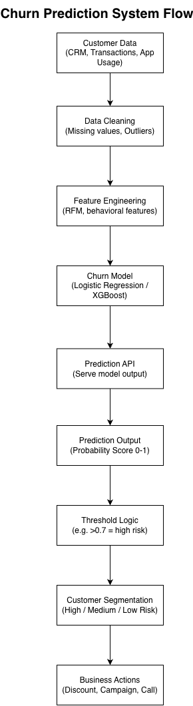

# Customer Churn Prediction System

## Business Problem

Customer churn leads to significant revenue loss.
Identifying high-risk customers early enables proactive retention strategies and improves customer lifetime value.

## System Architecture



## Project Overview

This project presents an end-to-end churn prediction system that combines machine learning with business decision workflows.

The system includes:

* Data collection from multiple sources (CRM, transactions, app usage)
* Data cleaning and preprocessing
* Feature engineering (behavioral and RFM-based features)
* Machine learning model for churn prediction
* API layer to serve predictions
* Threshold-based segmentation (high / medium / low risk)
* Business actions such as campaigns, discounts, and retention calls

## Model Performance

* ROC-AUC: 0.84
* Accuracy: 0.79
* Recall optimized for churn detection

## Model Comparison

| Model               | ROC-AUC |
| ------------------- | ------- |
| Logistic Regression | 0.84    |
| Random Forest       | 0.81    |

## Deployment

The system is deployed using Streamlit for real-time interaction:

* Input customer data
* Receive churn probability
* View risk segmentation

## API Example

### Request

```json
POST /predict-churn

{
  "customer_id": 12345,
  "tenure": 12,
  "monthly_spend": 250,
  "transaction_count": 45,
  "last_activity_days": 10
}
```

### Response

```json
{
  "customer_id": 12345,
  "churn_probability": 0.82,
  "risk_segment": "high"
}
```

## User Stories

### Churn Analyst

As a churn analyst, I want to identify high-risk customers so that I can take proactive actions to reduce churn.

### Marketing Team

As a marketing specialist, I want to target high-risk customers with personalized campaigns so that I can improve retention rates.

### System

As a system, I want to provide churn predictions via an API so that other applications can consume the results.

## Technologies

* Python
* Pandas, NumPy
* Scikit-learn
* Streamlit
* SQL
* Draw.io

## Outcome

This project demonstrates the ability to design an end-to-end machine learning system and integrate predictive models into business decision processes.

